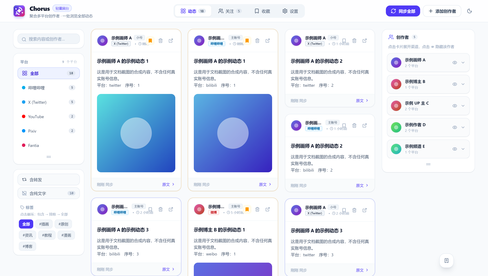

<div align="center">

<h1>Chorus</h1>
<p><b>把分散在各个平台的创作者动态，收进一个浏览器标签页。</b></p>
</div>

<div align="center">

[特性](#特性) · [支持平台](#支持平台) · [安装](#安装) · [文档](#文档) · [开源协议](#开源协议)

</div>

---

你把喜欢的画师、UP 主、博主关注在 B站、X、YouTube、Pixiv、小红书、微博……每隔几天就要挨个网站翻一遍，还要在推荐算法和乱序时间线里挑出真正的新内容。

Chorus 是一个**纯本地运行的浏览器扩展**。它把同一个人的多个平台账号归到一起，直接在浏览器里聚合展示他们的最新动态，按发布时间倒序排列。不需要注册，不需要登录任何第三方服务，没有后端服务器。

<!-- 截图位：替换为真实界面截图后删除本注释 -->
<!--  -->

## 特性

- **一位创作者，多个平台账号** —— 把 B站、X、Pixiv 等账号归到同一个人名下，动态统一展示。
- **一键关注当前页面** —— 在创作者主页点扩展图标，自动识别平台、UID、昵称与头像。
- **无算法时间线** —— 多列瀑布流，按时间倒序，只有你关注的人。
- **账号角色标记** —— 主账号 / 小号 / 里号·差分 / 自定义，可按角色筛选；卡片可拖拽排序。
- **七种排序、三种视图** —— 最近活跃、作品数、账号数、名称、标签、按平台、手动；网格 / 紧凑 / 详细。
- **组合筛选** —— 按平台、仅原创（滤转发）、仅图文；自定义标签支持 **包含 / 排除 / 全部** 三态循环。
- **深度回溯历史** —— 按条数（50/100）或时间跨度（近半年 / 近一年）往回拉取历史作品。
- **后台自动同步** —— 定时增量同步，未读数量显示在扩展角标上。
- **阅读位置记忆** —— 标记当前位置，刷新或切换标签页后一键跳回。
- **本地优先，无遥测** —— 关注列表、动态、已读与标签全部存在浏览器 IndexedDB，不收集任何数据。
- **图片离线归档** —— 把动态图片保存到本地文件夹（File System Access API），源站删帖也不丢。
- **备份与恢复** —— 全部数据导出为单个 JSON，方便换设备或重装。
- **开发者日志** —— 设置页内置诊断面板，可查看各平台请求状态与错误原因。

## 支持平台

扩展复用你当前浏览器在该平台的登录状态或公开接口，**不需要在插件里重复输入账号密码**。

| 平台 | 登录方式 | 支持内容 | 历史回溯 |
|:---|:---|:---|:---:|
| 哔哩哔哩 | 浏览器 Cookie | 图文动态、视频投稿、转发 | ✓ |
| X (Twitter) | 浏览器 Cookie / 页面会话 | 原创推文、转发、图片、视频 | ✓ |
| YouTube | 公开 RSS（免登录） | 最新视频投稿 | 仅最新 |
| Pixiv | 浏览器 Cookie | 插画、漫画、系列作品 | ✓ |
| Fantia | 浏览器 Cookie | 俱乐部动态、会员专享附件 | ✓ |
| 小红书 | 浏览器 Cookie | 图文笔记、视频笔记 | ✓ |
| 微博 | 浏览器 Cookie | 原创微博、转发、九宫格长图 | ✓ |
| 抖音 | 真实页面采集，不读取凭据 | 短视频、图文作品 | ✓ 需登录 |
| 通用 RSS / Atom | 免密公开协议 | 博客、Substack、RSSHub | 仅最新 |

> 部分平台的采集受其自身策略限制：**抖音**需在浏览器登录后才能回溯更早的作品，**X** 在请求过密时可能返回 429 限流；两者都不支持后台自动同步。其余细节见 [平台支持说明](docs/PLATFORMS.md)。

## 安装

### 从 Release 安装（推荐）

1. 到 [Releases](https://github.com/RoefQwQ/chorusdesk/releases) 下载最新的 `chorus-vX.Y.Z.zip` 并解压。
2. 打开浏览器扩展管理页 —— Chrome 输入 `chrome://extensions/`，Edge 输入 `edge://extensions/`。
3. 打开右上角的**开发者模式**。
4. 点**加载已解压的扩展程序**，选择刚解压出的文件夹。
5. 把 Chorus 图标固定到工具栏。

适用于 Chrome、Edge、Brave 等所有 Chromium 内核浏览器。目前未上架商店，需手动加载。

### 从源码构建

```bash
git clone https://github.com/RoefQwQ/chorusdesk.git
cd chorusdesk
npm install
npm run build      # 产物在 .output/chrome-mv3/
```

开发与发布用的其他命令：

```bash
npm run dev        # 热重载开发模式
npm run typecheck  # 类型检查
npm run lint       # 静态检查
npm test           # 回归测试
npm run e2e        # 真实 Chrome + 真实扩展的端到端门禁（需先 build）
npm run zip        # 打包成可分发 / 上架用的 zip
```

发布流程：`npm version patch|minor|major` 后 `git push --follow-tags`。版本号只在 `package.json` 维护，打 `vX.Y.Z` 标签会触发 CI 复跑全部门禁，并把 `chorus-vX.Y.Z.zip` 发布到 Releases。

## 文档

**使用**

- [用户使用手册](docs/USER_GUIDE.md) —— 关注、归集、筛选、回溯、归档、备份的具体操作
- [平台支持说明](docs/PLATFORMS.md) —— 各平台请求机制、授权方式、权限与凭据边界
- [常见问题 FAQ](docs/FAQ.md) —— 限流、图片加载、目录授权等
- [数据与隐私](docs/PRIVACY.md) —— 本地存储结构、无遥测声明、权限清单

**开发**

- [架构设计](docs/ARCHITECTURE.md) —— MV3 分层、消息协议、存储结构、数据流
- [开发手册](docs/DEVELOPMENT.md) —— 改动流程、平台适配器编写规范、验证规范

## 开源协议

[CC BY-NC-SA 4.0](LICENSE) —— 可自由使用与修改，**禁止商用**，衍生作品需以相同协议开源并署名。完整条款见 [LICENSE](LICENSE)。

<details>
<summary>为什么 GitHub 上显示为 “Other”</summary>

这是 GitHub 侧的限制，不是本仓库的配置问题。GitHub 的协议识别引擎 [licensee](https://github.com/licensee/licensee) 内置的 Creative Commons 协议只有 `CC-BY-4.0` / `CC-BY-SA-4.0` / `CC0-1.0` 三个，`CC-BY-NC-SA-4.0` 不在其中，因此无论 `LICENSE` 文本如何书写都只会显示为 `Other`。`package.json` 中的 SPDX 标识符与 [LICENSE](LICENSE) 原文是准确的。

</details>

## 免责声明

Chorus 是本地客户端工具，不提供内容托管或存储服务；所聚合内容的版权归原平台及作者所有。请遵守各平台的服务条款与当地法律法规。
